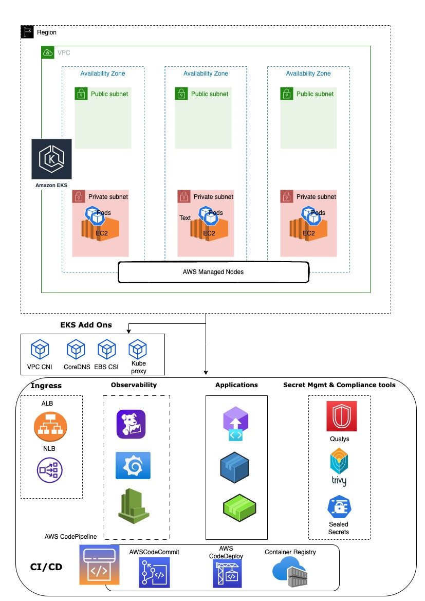
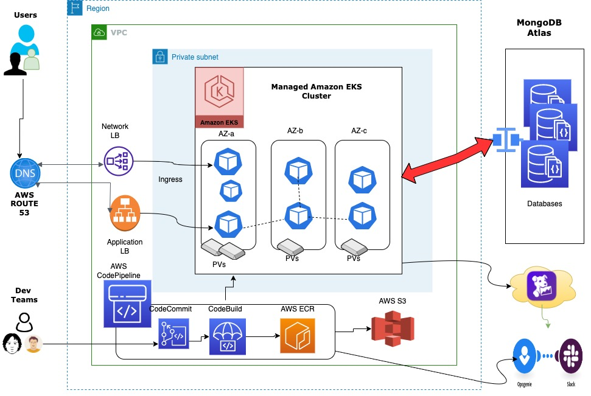

# AWS EKS in prod
* Resources in use
  * AWS VPC 
  * AWS EKS
  * Worker Nodes are in private subnets
  * Control Plane API only accessible internally + white listing allowed IPs
* post deployment componets which covers
  * Security & Compliance
    * Trivy
    * Qualys
    * AWS  Secret Manager
    * Sealed Secrets
  * Obervability ( Logs mgmt, CLuster / Resources metrics / APM / Notifications & Alerts )
    * Datadog
    * Slack
    * OpsGenie
  * Application Deployments
    * CI/CD
      * AWS CODEPIPELINE / CODEBUILD
    * Helm
    * Standard K8s yaml files
# Diagram

